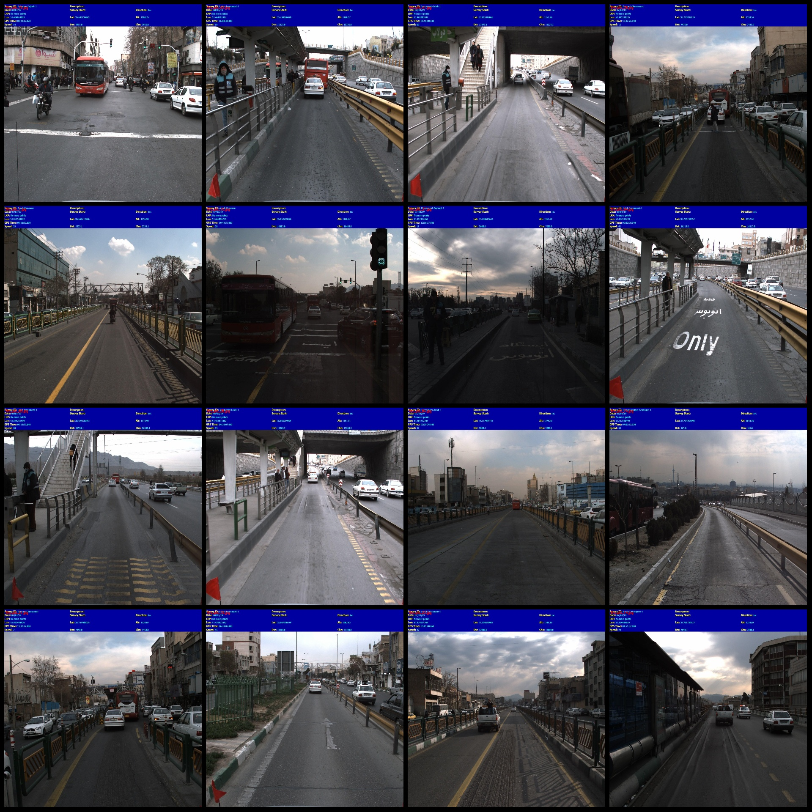
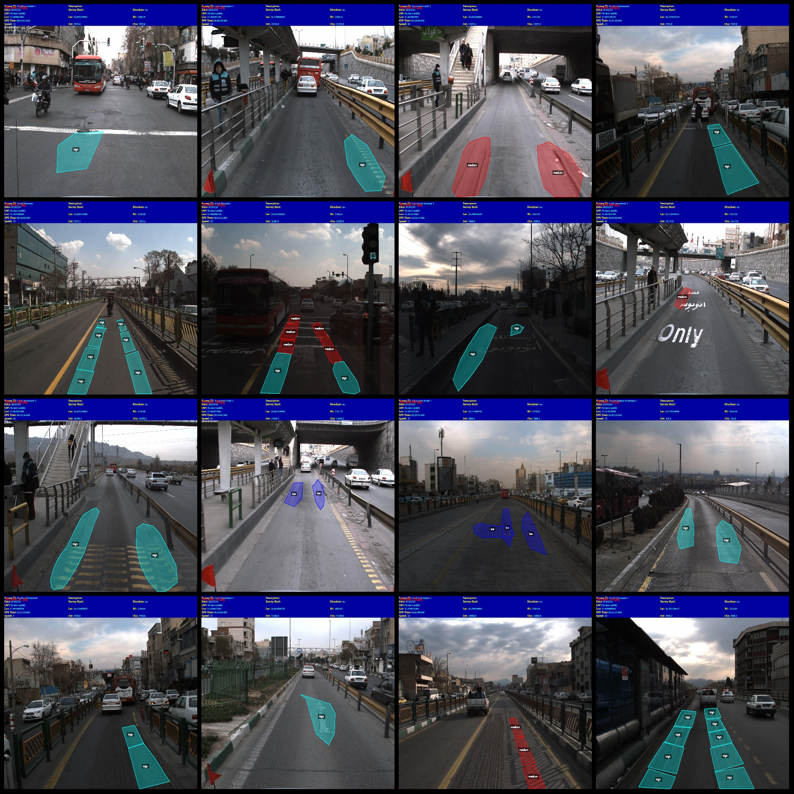
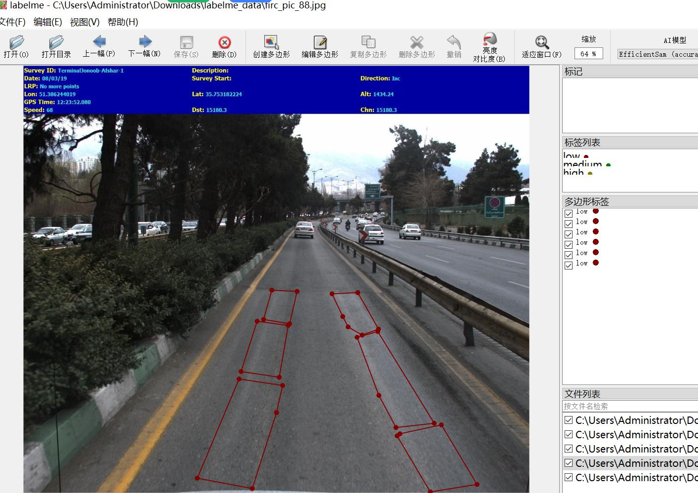
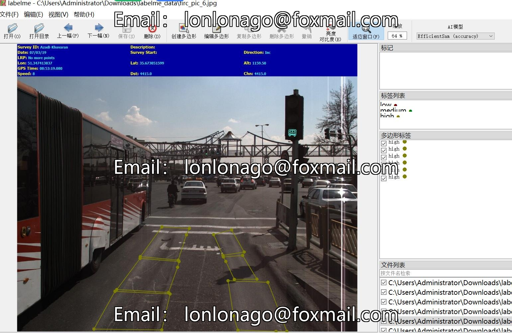

# Intelligent Transportation City Road Pavement Crater Marking and Identification Dataset

## Data Format: labelme format (without mask files, only including jpg images and corresponding json files)

### Image Count: 89 jpg files

### Annotation Count: 89 annotation files

### Number of Annotation Categories: 3

- Category Names: ["high", "low", "medium"]

- Box Count for Each Category:
  - High count = 79
  - Low count = 47
  - Medium count = 61
- Total Boxes: 187

### Annotation Tool: labelme v5.5.0

### Image Resolution: 1600x1352

### Annotation Rules: Polygon is drawn around the category.

### Import Note: You can open and edit the dataset with labelme v5.5.0; however, the json dataset needs to be converted into a mask or yolo or coco format for semantic segmentation or instance 
segmentation.

### Remark: This dataset does not guarantee the accuracy of the trained model or weight files.

### Image Preview:

### Annotation Example:

- Randomly selected 16 images for preview:

...

### Labelme Editing Example:

## Images

Here is a pay link on Stripe ( https://buy.stripe.com/3cs8yP7sY87d0vu9AB ). Please contact me lonlonago@foxmail.com after funding $89, and I will send you a complete data files , thank you!

